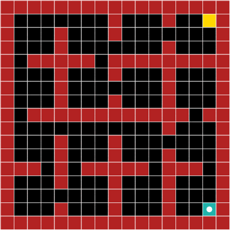
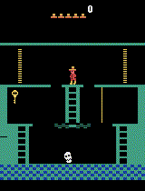
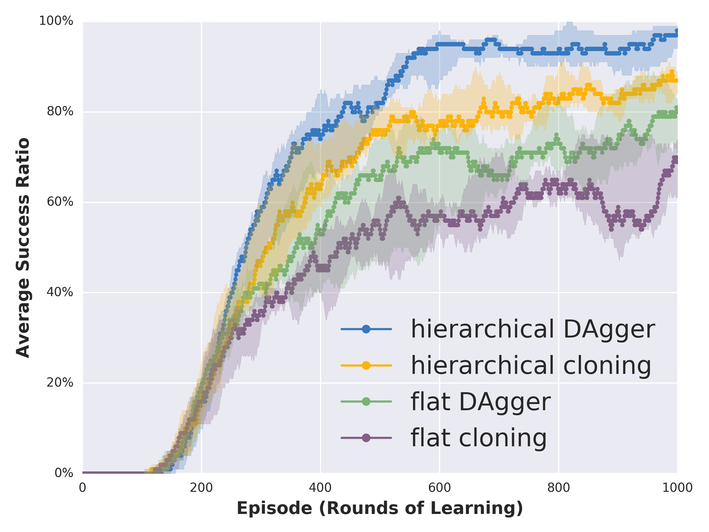
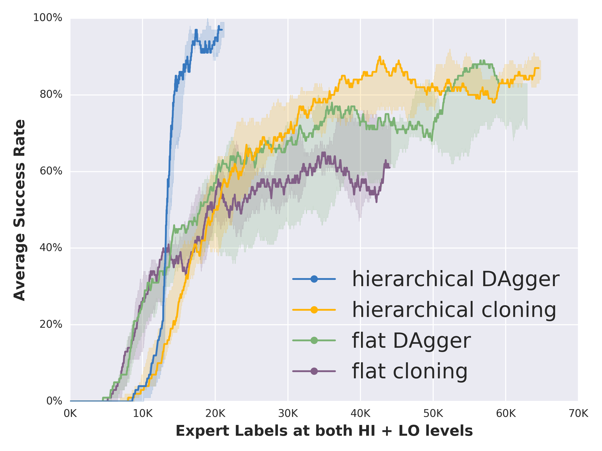

This is a course project based on the paper ["Hierarchical Imitation and Reinforcement Learning"](https://arxiv.org/abs/1803.00590). 

# Experiment Data
The saved model and experiment data are located "experiments" folder under "hierarchical_imitation_learning_Maze_Domain" and "hybrid_imitation_reinforcement_Montezuma" respectively.

# My Conda Environment 
    Python 2.7
    Tensorflow 1.13 
    Keras 2.2.4 
    
    Some required packages: 
        * The Arcade Learning Environment (https://github.com/mgbellemare/Arcade-Learning-Environment). $ sudo apt-get install libsdl1.2-dev
        * cv2
# Usage
    (1) For Maze Navigation, to train the hierachical IL agent and validate the performance (after every episode): 
        $ python train_hierarchical_dagger.py --model_dir=experiments/retrain
        To test the trained agent on unseen mazes: 
        $ python test_hierarchical_dagger.py --model_dir=experiments/retrain

    (2) For the Antari game,
        to test the trained model: 
            $ python test_model.py --model_dir=experiments/retrain    to specify the directory to save the trained model
        to train the agent: 
            $ python run_hybrid_atari_experiment.py --model_dir=experiments/retrain

The code is written based on the reference code in https://github.com/hoangminhle/hierarchical_IL_RL.

#### Example Result of Hierarchical DAgger on Maze Navigation ####

We have multiple random instances of the environment, with 4x4 room structure. The agent (white dot) is supposed to navigate to the destination in the yellow block,  while avoiding all the obstacles (red). Primitive actions are taking one step Up, Down, Left or Right. High level actions are navigating to the Room to the North, South, West, East or Stay (if the target block is in the same room). 

Here both the meta-controller and low-level controllers are learned with imitation learning. 

----
#### Example Result of Hybrid Imitation - Reinforcement Learning on Montezuma's Revenge first room ####

Panama Joe the adventurer needs to pick up the key, reverse his own path and go to open one of the two doors. 

For this instantiation of hybrid Imitation-Reinforcement learning, the meta-controller is trained with DAgger, and low-level controllers are learned with DDQN (Double Q Learning with prioritized experience replay). 

----
#### Hierarchical Imitation Learning vs. Flat Imitation Learning Comparison ####

 

----
#### Hybrid Imitation-Reinforcement Learning vs. Hierarchical RL Comparison ####

